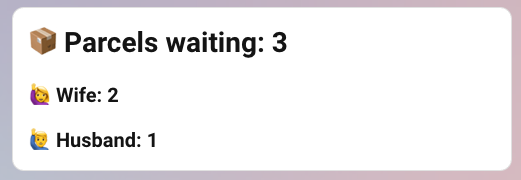

# 📦 InPost Paczkomaty - Home Assistant Integration

Track [InPost](https://inpost.pl/) parcels sent to a *Paczkomat®* (parcel locker) and monitor the occupancy of your
configured lockers.

> **Note:** The integration only tracks **en route** or **available for pickup** parcels. Parcels that have already been
> picked up or are otherwise delivered are ignored.

---

~~~
⚠️ Breaking Changes in version 0.3.0

> Important: Existing users will need to re-configure the integration after updating.

- OAuth2 authentication: External authentication service is no longer used
- Config entry structure: Data structure changed; existing configurations are incompatible

➡️ Migration Steps

Note: Simply re-adding the integration should work for most users. Full removal (steps 1-2) is only needed if you encounter issues.

1. Remove the existing InPost Paczkomaty integration from Home Assistant
2. Restart Home Assistant
3. Add the integration again and complete the new authentication flow
4. Re-select your preferred parcel lockers
~~~~

## How It Works

This Home Assistant integration tracks your parcels by fetching data from InPost servers via a **relay backend server**.

1. **Authentication:** You provide your **phone number** to the integration setup. You then receive an **SMS code**
   which you also provide. If prompted, verify your email by clicking the link in the email sent to you by InPost (this can be done on any device).
2. **Data Flow:** This authentication data is stored loccaly and send only to official InPost servers for authentication purposes. After succesfull authentication only API tokens are stored on you HA instance (refresh token, access token, etc).
3. **Polling:** Home Assistant polls the InPost API every **30 seconds** to retrieve the latest updates on your
   parcels.

---

## Installation

### HACS (Recommended)

1. Ensure **HACS** (Home Assistant Community Store) is installed.
2. Go to HACS, select **Integrations**, and click the **three-dot menu** $\rightarrow$ **Custom repositories**.
3. Add this integration's repository URL (if it's not already in the default HACS list).
4. Search for and install the **InPost Paczkomaty** integration.
5. **Restart Home Assistant**.
6. Go to **Settings** $\rightarrow$ **Devices & Services** $\rightarrow$ **Integrations** $\rightarrow$ **Add
   Integration**, and search for **InPost Paczkomaty**.
7. Complete the setup flow by providing your phone number and the received SMS code.
8. If prompted, verify your email by clicking the link in the email sent by InPost (this can be done on any device). **Note:** This is a legitimate verification email - it will **not** ask for any credentials. Once verified, click `Submit` to proceed.
9. Select the parcel lockers you wish to monitor. Your favorite lockers from your InPost profile will be pre-selected automatically.

### Manual Installation

1. Download the latest release ZIP file.
2. Unpack the release and copy the content into the `custom_components/inpost_paczkomaty` directory within your Home
   Assistant configuration folder.
3. **Restart Home Assistant**.
4. Execute steps **6, 7, and 8** from the HACS installation method above.

## Usage Examples

### Dashboard panel

Display parcel counts directly on your Home Assistant dashboard to see at a glance how many packages are waiting for pickup. This is especially handy if you have a dashboard near your door—check whether a trip to the Paczkomat® is needed before heading out.

**Markdown panel example:**



```text
# 📦 Parcels waiting: {{ (states('sensor.inpost_123456789_ready_for_pickup_parcels_count') | int) + (states('sensor.inpost_987654321_ready_for_pickup_parcels_count') | int) }}
## 🙋‍♀️ Wife: {{ states('sensor.inpost_987654321_ready_for_pickup_parcels_count') }}
## 🙋‍♂️ Husband: {{ states('sensor.inpost_123456789_ready_for_pickup_parcels_count') }}
```

#### Parcels ready for pick up notification

Get a notification on your phone when you're approaching home and parcels are waiting at the Paczkomat®. This way, you can stop by the locker on your way in - no need to get home first, only to remember that you or someone else in your household has a package to collect.

```yaml
alias: Parcel pickup reminder
description: ""
triggers:
  - trigger: zone
    entity_id: person.husband
    zone: zone.home
    event: enter
conditions:
  - condition: or
    conditions:
      - condition: numeric_state
        entity_id: sensor.inpost_123456789_ready_for_pickup_parcels_count
        above: 0
      - condition: numeric_state
        entity_id: sensor.inpost_987654321_ready_for_pickup_parcels_count
        above: 0
actions:
  - action: notify.mobile_app_iphone_husband
    metadata: {}
    data:
      title: 📦 Parcels waiting
      message: >-
        🙋‍♀️ Wife: {{
        states('sensor.inpost_987654321_ready_for_pickup_parcels_count') }}.

        🙋‍♂️ Husband: {{
        states('sensor.inpost_123456789_ready_for_pickup_parcels_count') }}.
mode: single
```

## Entities

The integration creates entities for the overall account (phone number registered in InPost mobile app) and for each tracked parcel locker.

### Summary Entities

| Platform | Entity                                                 | Description                                                                                              |
|:---------|:-------------------------------------------------------|:---------------------------------------------------------------------------------------------------------|
| `sensor` | `inpost_[PHONE_NUMBER]_all_parcels_count`              | Total number of all tracked parcels bound to your phone number(Delivered + En Route + Ready for Pickup). |
| `sensor` | `inpost_[PHONE_NUMBER]_en_route_parcels_count`         | Number of parcels currently en route to any locker.                                                      |
| `sensor` | `inpost_[PHONE_NUMBER]_ready_for_pickup_parcels_count` | Number of parcels ready for pickup across all configured lockers.                                        |

### Per-Locker Entities

For each configured locker (identified by `[LOCKER_ID]`), the following entities are created:

| Platform        | Entity                                                     | Description                                                                        |
|:----------------|:-----------------------------------------------------------|:-----------------------------------------------------------------------------------|
| `sensor`        | `inpost_[PHONE_NUMBER]_[LOCKER_ID]_locker_id`              | The public ID of the specific parcel locker.                                       |
| `sensor`        | `inpost_[PHONE_NUMBER]_[LOCKER_ID]_description`            | Description of the locker location (e.g., "przy sklepie Biedronka").               |
| `sensor`        | `inpost_[PHONE_NUMBER]_[LOCKER_ID]_address`                | Full address of the locker (city, zip code, street, building number).              |
| `binary_sensor` | `inpost_[PHONE_NUMBER]_[LOCKER_ID]_ready_for_pickup`       | $\text{True}$ if **any** parcels are available for pickup in this specific locker. |
| `sensor`        | `inpost_[PHONE_NUMBER]_[LOCKER_ID]_ready_for_pickup_count` | Number of parcels available for pickup in this specific locker.                    |
| `binary_sensor` | `inpost_[PHONE_NUMBER]_[LOCKER_ID]_parcels_en_route`       | $\text{True}$ if **any** parcels are en route to this specific locker.             |
| `sensor`        | `inpost_[PHONE_NUMBER]_[LOCKER_ID]_en_route_count`         | Number of parcels currently en route to this specific locker.                      |

---

## Features

* Monitor the **total** number of parcels associated with your account (Delivered + En Route + Ready for Pickup).
* Monitor the number of parcels **en route** across all destinations.
* Monitor configured lockers:
    * Count of **en route** parcels destined for the locker.
    * Count of parcels **ready for pickup** at the locker.

## Roadmap (in no particular order)

* Support tracking parcels sent to a parcel locker that **has not been configured** in the initial setup.
* Expose phone number and access code via a Home Assistant entity or attribute.
* Add a `inpost_[PHONE_NUMBER]_[LOCKER_ID]_deadline` entity to monitor pickup deadlines for each ready-for-pickup parcel in a locker.
* Add branding images to https://github.com/home-assistant/brands
* Add this repository to HACS

Please create a new GitHub Issue for any feature request you might have.

---

## Disclaimers

| Item             | Details                                                                                                                                   |
|:-----------------|:------------------------------------------------------------------------------------------------------------------------------------------|
| **Usage Limits** | InPost API may apply HTTP request rate limiting.                                                                                          |
|   **API AUTH**   | InPost API may require additional authentication in future. Currently this integration use refresh token to keep access token up to date. |
| **Inspiration**  | Some parts of the codebase were **heavily** inspired by [InPost-Air](https://github.com/CyberDeer/InPost-Air).                            |
