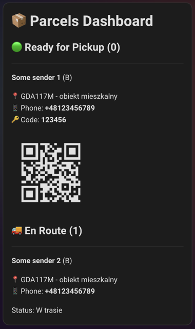

# 📦 InPost Paczkomaty - Home Assistant Integration

Track [InPost](https://inpost.pl/) parcels sent to a *Paczkomat®* (parcel locker) and monitor the occupancy of your
configured lockers.

> **Note:** The integration only tracks **en route** or **available for pickup** parcels. Parcels that have already been
> picked up or are otherwise delivered are ignored.

---

~~~
⚠️ Breaking Changes in version 0.3.0

> Important: Existing users will need to re-configure the integration after updating.

- OAuth2 authentication: External authentication service is no longer used
- Config entry structure: Data structure changed; existing configurations are incompatible

➡️ Migration Steps

Note: Simply re-adding the integration should work for most users. Full removal (steps 1-2) is only needed if you encounter issues.

1. Remove the existing InPost Paczkomaty integration from Home Assistant
2. Restart Home Assistant
3. Add the integration again and complete the new authentication flow
4. Re-select your preferred parcel lockers
~~~~

## How It Works

1. **Authentication:** You provide your **phone number** to the integration setup. You then receive an **SMS code**
   which you also provide. If prompted, verify your email by clicking the link in the email sent to you by InPost (this can be done on any device).
2. **Data Flow:** Authentication data is stored locally and send only to official InPost servers for authentication purposes. After successful authentication API tokens are stored on you HA instance (refresh token, access token, etc).
3. **Polling:** Home Assistant polls the InPost API every **30 seconds** (configurable) to retrieve the latest updates on your
   parcels.

---

## Installation

### HACS (Recommended)

1. Ensure **HACS** (Home Assistant Community Store) is installed.
2. Go to HACS, select **Integrations**, and click the **three-dot menu** $\rightarrow$ **Custom repositories**.
3. Add this integration's repository URL (if it's not already in the default HACS list).
4. Search for and install the **InPost Paczkomaty** integration.
5. **Restart Home Assistant**.
6. Go to **Settings** $\rightarrow$ **Devices & Services** $\rightarrow$ **Integrations** $\rightarrow$ **Add
   Integration**, and search for **InPost Paczkomaty**.
7. Complete the setup flow by providing your phone number and the received SMS code.
8. If prompted, verify your email by clicking the link in the email sent by InPost (this can be done on any device). **Note:** This is a legitimate verification email - it will **not** ask for any credentials. Once verified, click `Submit` to proceed.
9. Select the parcel lockers you wish to monitor. Your favorite lockers from your InPost profile will be pre-selected automatically.

### Manual Installation

1. Download the latest release ZIP file.
2. Unpack the release and copy the content into the `custom_components/inpost_paczkomaty` directory within your Home
   Assistant configuration folder.
3. **Restart Home Assistant**.
4. Execute steps **6, 7, and 8** from the HACS installation method above.

---

## Configuration

The integration can be customized via `configuration.yaml`. All options are **optional** and have sensible defaults.

```yaml
inpost_paczkomaty:
  update_interval_seconds: 30
  http_timeout_seconds: 30
  ignored_en_route_statuses:
    - CONFIRMED
  show_only_own_parcels: false
  parcel_lockers_url: "https://inpost.pl/sites/default/files/points.json"
```

### Configuration Options

| Option | Type | Default | Description |
|:-------|:-----|:--------|:------------|
| `update_interval_seconds` | integer | `30` | How often (in seconds) the integration polls the InPost API for updates. |
| `http_timeout_seconds` | integer | `30` | HTTP request timeout in seconds. Increase if you experience timeout errors. |
| `ignored_en_route_statuses` | list | `["CONFIRMED"]` | List of parcel statuses to exclude from "en route" counts. See [Available Statuses](#available-en-route-statuses) below. |
| `show_only_own_parcels` | boolean | `false` | When `true`, only shows parcels you own. When `false`, also shows parcels shared with you by others (e.g., family members). Useful to avoid duplicate counting in multi-user households. |
| `parcel_lockers_url` | url | `https://inpost.pl/sites/default/files/points.json` | URL for fetching the parcel lockers list. Only change if InPost changes their endpoint or if you want to use custom parcel lockers list. |

### Available En Route Statuses

The following statuses are considered "en route" by default:

| Status | Description |
|:-------|:------------|
| `CONFIRMED` | Parcel has been confirmed/created by sender (ignored by default) |
| `DISPATCHED_BY_SENDER` | Parcel dispatched by sender |
| `TAKEN_BY_COURIER` | Parcel picked up by courier |
| `ADOPTED_AT_SOURCE_BRANCH` | Parcel received at source branch |
| `SENT_FROM_SOURCE_BRANCH` | Parcel sent from source branch |
| `OUT_FOR_DELIVERY` | Parcel is out for delivery |

By default, `CONFIRMED` is ignored because parcels in this status are often just created but not yet physically handed over to InPost.

**Example:** To ignore both `CONFIRMED` and `DISPATCHED_BY_SENDER`:

```yaml
inpost_paczkomaty:
  ignored_en_route_statuses:
    - CONFIRMED
    - DISPATCHED_BY_SENDER
```

**Example:** To show all en route statuses (don't ignore any):

```yaml
inpost_paczkomaty:
  ignored_en_route_statuses: []
```

### Multi-User Households

If multiple family members are configured in HA and share parcels with each other, you might see duplicate parcel counts. Use `show_only_own_parcels: true` to only count parcels that belong to InPost account owner:

```yaml
inpost_paczkomaty:
  show_only_own_parcels: true
```

---

## Usage Examples

### Dashboard panel

Display parcel counts directly on your Home Assistant dashboard to see at a glance how many packages are waiting for pickup. This is especially handy if you have a dashboard near your door—check whether a trip to the Paczkomat® is needed before heading out.

**Markdown panel example:**


```text
# 📦 Parcels waiting: {{ (states('sensor.inpost_123456789_ready_for_pickup_parcels_count') | int) + (states('sensor.inpost_987654321_ready_for_pickup_parcels_count') | int) }}
## 🙋‍♀️ Wife: {{ states('sensor.inpost_987654321_ready_for_pickup_parcels_count') }}
## 🙋‍♂️ Husband: {{ states('sensor.inpost_123456789_ready_for_pickup_parcels_count') }}
```

#### Advanced Parcels Dashboard with QR Codes

Display detailed parcels information with QR codes for easy pickup using Home Assistant's built-in `<ha-qr-code>` component.



**Markdown card configuration:**

```yaml
type: markdown
content: |
  
  
  

  # 📦 Parcels Dashboard

  ## 🟢 Ready for Pickup ({{ ready | length }})

  
  ---
  **{{ p.sender_name or 'Unknown sender' }}** ({{ p.parcel_size }})

  📍 **{{ p.pickup_point_name or 'Courier' }}** - {{ p.pickup_point_description }}

  {{ p.pickup_point_address }}

  📱 Phone: **{{ p.phone_number }}**

  🔑 Code: **{{ p.open_code }}**

  <ha-qr-code data="{{ p.qr_code }}" width="150"></ha-qr-code>

  

  
  ## 🚚 En Route ({{ en_route | length }})

  
  ---
  **{{ p.sender_name or 'Unknown sender' }}** ({{ p.parcel_size }})

  📍 {{ p.pickup_point_name or 'Courier delivery' }} - {{ p.pickup_point_description }}

  📱 Phone: **{{ p.phone_number }}**

  Status: {{ p.status_description }}

  
  
```

**Simpler version without QR codes:**

```yaml
type: markdown
content: |
  
  
  

  # 📦 Parcels: {{ ready | length }} ready, {{ en_route | length }} en route

  
  ---
  ## 🟢 {{ p.sender_name or 'Unknown' }}
  📍 {{ p.pickup_point_name }} | 🔑 **{{ p.open_code }}**
  

  
  ---
  ## 🚚 {{ p.sender_name or 'Unknown' }}
  📍 {{ p.pickup_point_name or 'Courier' }} | {{ p.status_description }}
  
```

#### Parcels ready for pick up notification

Get a notification on your phone when you're approaching home and parcels are waiting at the Paczkomat®. This way, you can stop by the locker on your way in - no need to get home first, only to remember that you or someone else in your household has a package to collect.

```yaml
alias: Parcel pickup reminder
description: ""
triggers:
  - trigger: zone
    entity_id: person.husband
    zone: zone.home
    event: enter
conditions:
  - condition: or
    conditions:
      - condition: numeric_state
        entity_id: sensor.inpost_123456789_ready_for_pickup_parcels_count
        above: 0
      - condition: numeric_state
        entity_id: sensor.inpost_987654321_ready_for_pickup_parcels_count
        above: 0
actions:
  - action: notify.mobile_app_iphone_husband
    metadata: {}
    data:
      title: 📦 Parcels waiting
      message: >-
        🙋‍♀️ Wife: {{
        states('sensor.inpost_987654321_ready_for_pickup_parcels_count') }}.

        🙋‍♂️ Husband: {{
        states('sensor.inpost_123456789_ready_for_pickup_parcels_count') }}.
mode: single
```

## Entities

The integration creates entities for the overall account (phone number registered in InPost mobile app) and for each tracked parcel locker.

### Summary Entities

| Platform | Entity                                                 | Description                                                                                              |
|:---------|:-------------------------------------------------------|:---------------------------------------------------------------------------------------------------------|
| `sensor` | `inpost_[PHONE_NUMBER]_all_parcels_count`              | Total number of all tracked parcels bound to your phone number(Delivered + En Route + Ready for Pickup). |
| `sensor` | `inpost_[PHONE_NUMBER]_en_route_parcels_count`         | Number of parcels currently en route to any locker.                                                      |
| `sensor` | `inpost_[PHONE_NUMBER]_ready_for_pickup_parcels_count` | Number of parcels ready for pickup across all configured lockers.                                        |
| `sensor` | `inpost_[PHONE_NUMBER]_parcels_list`                   | Parcels list sensor with detailed parcel data for dashboard display (see attributes below).              |

#### Parcels List Sensor Attributes

The `parcels_list` sensor provides detailed parcel information for advanced dashboard cards:

| Attribute                | Type  | Description                                                              |
|:-------------------------|:------|:-------------------------------------------------------------------------|
| `ready_for_pickup`       | list  | List of parcels ready for pickup with open codes and QR codes.           |
| `en_route`               | list  | List of parcels in transit.                                              |
| `ready_for_pickup_count` | int   | Number of parcels ready for pickup.                                      |
| `en_route_count`         | int   | Number of parcels en route.                                              |

Each parcel in the list contains:

| Field                      | Description                                                |
|:---------------------------|:-----------------------------------------------------------|
| `shipment_number`          | Parcel tracking number.                                    |
| `sender_name`              | Name of the sender.                                        |
| `status`                   | Current parcel status.                                     |
| `status_description`       | Human-readable status description.                         |
| `shipment_type`            | Type: "parcel" (locker) or "courier".                      |
| `parcel_size`              | Size: A, B, C, or OTHER.                                   |
| `phone_number`             | Receiver phone number (e.g., "+48987654321").              |
| `pickup_point_name`        | Locker code (e.g., "GDA117M") or null for courier.         |
| `pickup_point_address`     | Formatted address of pickup point.                         |
| `pickup_point_description` | Location description (e.g., "obiekt mieszkalny").          |
| `open_code`                | Code to open the locker (only for ready_to_pickup).        |
| `qr_code`                  | QR code data string (only for ready_to_pickup).            |
| `stored_date`              | When parcel was stored in locker (ISO format).             |

### Carbon Footprint Entities

| Platform | Entity                                                      | Description                                                                                     |
|:---------|:------------------------------------------------------------|:------------------------------------------------------------------------------------------------|
| `sensor` | `inpost_[PHONE_NUMBER]_total_carbon_footprint`              | Total cumulative CO₂ in kg from all delivered parcels.                                          |
| `sensor` | `inpost_[PHONE_NUMBER]_today_carbon_footprint`              | CO₂ in kg from parcels picked up today.                                                         |
| `sensor` | `inpost_[PHONE_NUMBER]_carbon_footprint_statistics`         | Statistics sensor with daily breakdown data for graph visualization (see attributes below).     |

#### Carbon Footprint Statistics Attributes

The `carbon_footprint_statistics` sensor provides the following attributes for advanced visualization:

| Attribute         | Type  | Description                                                              |
|:------------------|:------|:-------------------------------------------------------------------------|
| `daily_data`      | list  | List of `{date, value, parcel_count}` objects for daily CO₂ graphs.      |
| `cumulative_data` | list  | List of `{date, value}` objects for cumulative CO₂ graphs.               |
| `total_co2_kg`    | float | Total carbon footprint in kilograms.                                     |
| `total_parcels`   | int   | Total number of delivered parcels counted.                               |

> **How Carbon Footprint is Calculated:**
> - Only **DELIVERED** parcels are counted
> - Uses `boxMachineDelivery` value (lower CO₂) if parcel was picked up from a **parcel locker**
> - Uses `addressDelivery` value (higher CO₂) if parcel was delivered by **courier**
> - Respects `show_only_own_parcels` configuration setting
> - Uses `pickUpDate` as the date for statistics

### Per-Locker Entities

For each configured locker (identified by `[LOCKER_ID]`), the following entities are created:

| Platform        | Entity                                                     | Description                                                                        |
|:----------------|:-----------------------------------------------------------|:-----------------------------------------------------------------------------------|
| `sensor`        | `inpost_[PHONE_NUMBER]_[LOCKER_ID]_locker_id`              | The public ID of the specific parcel locker.                                       |
| `sensor`        | `inpost_[PHONE_NUMBER]_[LOCKER_ID]_description`            | Description of the locker location (e.g., "przy sklepie Biedronka").               |
| `sensor`        | `inpost_[PHONE_NUMBER]_[LOCKER_ID]_address`                | Full address of the locker (city, zip code, street, building number).              |
| `binary_sensor` | `inpost_[PHONE_NUMBER]_[LOCKER_ID]_ready_for_pickup`       | $\text{True}$ if **any** parcels are available for pickup in this specific locker. |
| `sensor`        | `inpost_[PHONE_NUMBER]_[LOCKER_ID]_ready_for_pickup_count` | Number of parcels available for pickup in this specific locker.                    |
| `binary_sensor` | `inpost_[PHONE_NUMBER]_[LOCKER_ID]_parcels_en_route`       | $\text{True}$ if **any** parcels are en route to this specific locker.             |
| `sensor`        | `inpost_[PHONE_NUMBER]_[LOCKER_ID]_en_route_count`         | Number of parcels currently en route to this specific locker.                      |

---

## Carbon Footprint Tracking

The integration tracks the carbon footprint (CO₂ emissions) of your delivered parcels. This helps you understand the environmental impact of your deliveries and encourages the use of parcel lockers, which have a significantly lower carbon footprint compared to home delivery.


### Data Persistence

> **Important:** Understanding how historical data is stored

Home Assistant provides two ways to access historical data:

1. **Long-Term Statistics (LTS)**: Because the carbon footprint sensors have `state_class` attributes, Home Assistant automatically records hourly statistics that are kept **indefinitely**. This is the recommended way to view historical carbon footprint data.

2. **Sensor Attributes**: The `daily_data` and `cumulative_data` attributes in the statistics sensor are computed from the **current API response**. If InPost removes old parcels from their API (e.g., only returns the last 3 months), these attributes will not include older data.

**Recommendation:** For long-term carbon footprint tracking, use Home Assistant's built-in statistics features (see examples below) rather than relying on sensor attributes.

### Visualization Examples

#### Using Statistics Graph Card (Built-in)

The statistics graph card uses Home Assistant's long-term statistics, which persist even after old data is removed from the API:

```yaml
type: statistics-graph
title: Carbon Footprint Over Time
entities:
  - sensor.inpost_123456789_total_carbon_footprint
stat_types:
  - state
days_to_show: 180
```

#### Using History Graph Card (Built-in)

```yaml
type: history-graph
title: Daily Carbon Footprint
entities:
  - entity: sensor.inpost_123456789_today_carbon_footprint
hours_to_show: 720  # 30 days
```

#### Using ApexCharts Card (HACS)

For more advanced visualization, install [ApexCharts Card](https://github.com/RomRider/apexcharts-card) from HACS.

**Daily Carbon Footprint Bar Chart:**

```yaml
type: custom:apexcharts-card
header:
  show: true
  title: Daily Carbon Footprint (kg CO₂)
  show_states: true
graph_span: 30d
span:
  end: day
series:
  - entity: sensor.inpost_123456789_carbon_footprint_statistics
    name: Daily CO₂
    type: column
    data_generator: |
      return entity.attributes.daily_data.map(d => {
        return [new Date(d.date).getTime(), d.value];
      });
```

**Cumulative Carbon Footprint Line Chart:**

```yaml
type: custom:apexcharts-card
header:
  show: true
  title: Cumulative Carbon Footprint (kg CO₂)
  show_states: true
graph_span: 90d
series:
  - entity: sensor.inpost_123456789_carbon_footprint_statistics
    name: Total CO₂
    type: area
    curve: smooth
    data_generator: |
      return entity.attributes.cumulative_data.map(d => {
        return [new Date(d.date).getTime(), d.value];
      });
apex_config:
  fill:
    type: gradient
    gradient:
      shadeIntensity: 0.8
      opacityFrom: 0.7
      opacityTo: 0.3
```

**Combined Daily and Cumulative Chart:**

```yaml
type: custom:apexcharts-card
header:
  show: true
  title: Carbon Footprint Analysis
graph_span: 30d
yaxis:
  - id: daily
    opposite: false
    decimals: 3
    apex_config:
      title:
        text: Daily (kg)
  - id: cumulative
    opposite: true
    decimals: 2
    apex_config:
      title:
        text: Cumulative (kg)
series:
  - entity: sensor.inpost_123456789_carbon_footprint_statistics
    name: Daily
    type: column
    yaxis_id: daily
    data_generator: |
      return entity.attributes.daily_data.map(d => {
        return [new Date(d.date).getTime(), d.value];
      });
  - entity: sensor.inpost_123456789_carbon_footprint_statistics
    name: Cumulative
    type: line
    yaxis_id: cumulative
    curve: smooth
    data_generator: |
      return entity.attributes.cumulative_data.map(d => {
        return [new Date(d.date).getTime(), d.value];
      });
```

**Using Long-Term Statistics with ApexCharts (Recommended for persistence):**

This method uses Home Assistant's recorded statistics, ensuring data persists even after old parcels are removed from the API:

```yaml
type: custom:apexcharts-card
header:
  show: true
  title: Carbon Footprint (Long-Term Statistics)
graph_span: 6mo
span:
  end: day
series:
  - entity: sensor.inpost_123456789_total_carbon_footprint
    name: Total CO₂
    type: line
    statistics:
      type: state
      period: day
```

---

## Features

* Monitor the **total** number of parcels associated with your account (Delivered + En Route + Ready for Pickup).
* Monitor the number of parcels **en route** across all destinations.
* Monitor configured lockers:
    * Count of **en route** parcels destined for the locker.
    * Count of parcels **ready for pickup** at the locker.
* Track **carbon footprint** of delivered parcels with daily and cumulative statistics.

## Roadmap (in no particular order)

* Support tracking parcels sent to a parcel locker that **has not been configured** in the initial setup.
* Expose phone number and access code via a Home Assistant entity or attribute.
* Add a `inpost_[PHONE_NUMBER]_[LOCKER_ID]_deadline` entity to monitor pickup deadlines for each ready-for-pickup parcel in a locker.
* Add branding images to https://github.com/home-assistant/brands
* Add this repository to HACS

Please create a new GitHub Issue for any feature request you might have.

---

## Disclaimers

| Item             | Details                                                                                                                                   |
|:-----------------|:------------------------------------------------------------------------------------------------------------------------------------------|
| **Usage Limits** | InPost API may apply HTTP request rate limiting.                                                                                          |
| **API AUTH**     | InPost API may require additional authentication in future. Currently this integration use refresh token to keep access token up to date. |
| **Inspiration**  | Some parts of the codebase were **heavily** inspired by [InPost-Air](https://github.com/CyberDeer/InPost-Air).                            |
